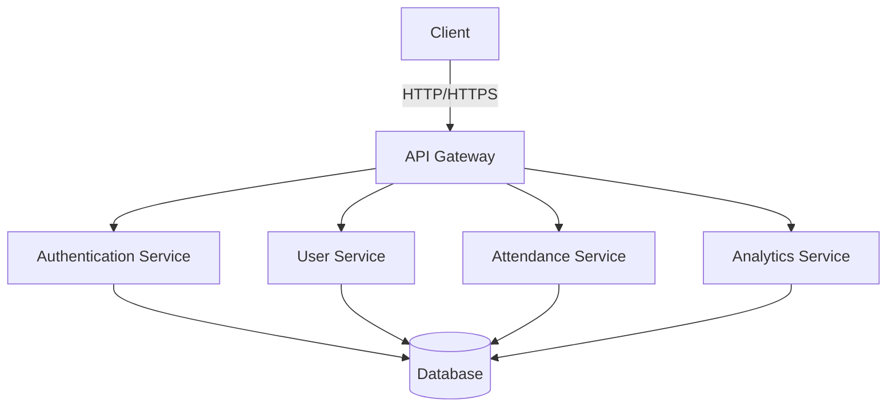

# Attendance Management System Documentation

## Overview

The Attendance Management System is a comprehensive MERN stack application designed to manage and track attendance for organizations. It provides features for user management, attendance tracking, analytics, and reporting.

## Table of Contents

1. [Getting Started](getting-started/README.md)
   - [Prerequisites](getting-started/prerequisites.md)
   - [Installation](getting-started/installation.md)
   - [Configuration](getting-started/configuration.md)

2. [Architecture](architecture/README.md)
   - [System Overview](architecture/system-overview.md)
   - [Database Schema](architecture/database-schema.md)
   - [API Design](architecture/api-design.md)

3. [Core Features](features/README.md)
   - [Authentication](features/authentication.md)
   - [User Management](features/user-management.md)
   - [Attendance Tracking](features/attendance.md)
   - [Analytics & Reporting](features/analytics.md)

4. [API Reference](api/README.md)
   - [Authentication API](api/auth.md)
   - [User API](api/users.md)
   - [Attendance API](api/attendance.md)
   - [Analytics API](api/analytics.md)

5. [Utilities](utils/README.md)
   - [Date Utilities](utils/DateUtil.md)
   - [Response Utilities](utils/ResponseUtil.md)
   - [Crypto Utilities](utils/CryptoUtil.md)

6. [Security](security/README.md)
   - [Authentication & Authorization](security/auth.md)
   - [Data Protection](security/data-protection.md)
   - [Best Practices](security/best-practices.md)

7. [Development Guide](development/README.md)
   - [Setup Guide](development/setup.md)
   - [Coding Standards](development/coding-standards.md)
   - [Testing Guide](development/testing.md)

8. [Deployment](deployment/README.md)
   - [Environment Setup](deployment/environment.md)
   - [Deployment Guide](deployment/guide.md)
   - [Monitoring](deployment/monitoring.md)

## Quick Start

### Prerequisites
- Node.js (v14 or higher)
- MongoDB (v4.4 or higher)
- npm or yarn

### Installation

```bash
# Clone the repository
git clone https://github.com/your-org/attendance-system.git

# Install dependencies
cd attendance-system
npm install

# Configure environment
cp .env.example .env
# Edit .env with your configuration

# Start development server
npm run dev
```

### Basic Usage

1. **User Management**
```javascript
// Create a new user
const user = await userService.createUser({
  name: 'John Doe',
  email: 'john@example.com',
  dayGroup: 'Monday',
  role: 'member'
});
```

2. **Attendance Tracking**
```javascript
// Mark attendance
const attendance = await attendanceService.markAttendance({
  userId: user.id,
  date: new Date(),
  status: 'present'
});
```

3. **Analytics**
```javascript
// Get attendance analytics
const analytics = await analyticsService.getAttendanceAnalytics({
  startDate: new Date('2024-01-01'),
  endDate: new Date('2024-03-31'),
  dayGroup: 'Monday'
});
```

## Key Features

1. **User Management**
   - Role-based access control
   - User groups and hierarchies
   - Profile management

2. **Attendance Tracking**
   - Daily attendance marking
   - Multiple day groups
   - Attendance verification
   - Leave management

3. **Analytics & Reporting**
   - Attendance trends
   - Group analytics
   - Custom report generation
   - Data export (CSV/PDF)

4. **Security**
   - JWT authentication
   - Role-based authorization
   - Data encryption
   - Secure password handling

## Architecture

### System Components



### Technology Stack

- **Frontend**: React.js with Material-UI
- **Backend**: Node.js with Express
- **Database**: MongoDB with Mongoose
- **Authentication**: JWT with bcrypt
- **API**: RESTful with OpenAPI/Swagger
- **Testing**: Jest and Supertest

## Security Measures

1. **Authentication**
   - JWT-based authentication
   - Secure password hashing
   - Token refresh mechanism
   - Rate limiting

2. **Authorization**
   - Role-based access control
   - Resource-level permissions
   - API endpoint protection

3. **Data Protection**
   - Data encryption at rest
   - Secure communication (HTTPS)
   - Input validation
   - XSS protection

## Best Practices

1. **Code Organization**
   - Modular architecture
   - Clear separation of concerns
   - Consistent coding style
   - Comprehensive documentation

2. **Error Handling**
   - Centralized error handling
   - Detailed error logging
   - User-friendly error messages
   - Graceful degradation

3. **Performance**
   - Database indexing
   - Query optimization
   - Caching strategies
   - Load balancing

## Contributing

1. Fork the repository
2. Create a feature branch
3. Make your changes
4. Write/update tests
5. Submit a pull request

## License

This project is licensed under the MIT License - see the [LICENSE](LICENSE) file for details.

## Support

For support and questions:
- Create an issue in the repository
- Contact the development team
- Check the documentation

## Roadmap

- [ ] Advanced analytics features
- [ ] Mobile application
- [ ] Integration with HR systems
- [ ] Automated reporting
- [ ] Machine learning predictions 